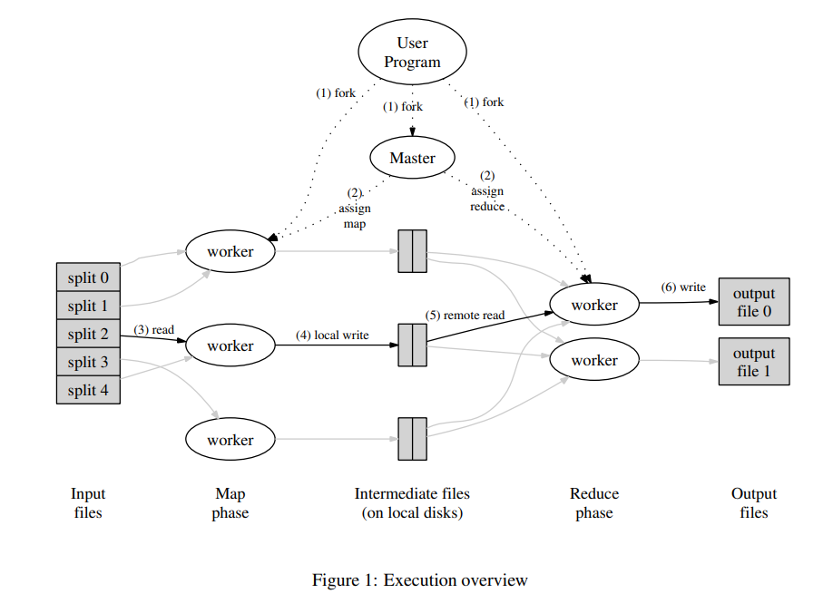

### MapReduce
http://nil.csail.mit.edu/6.5840/2025/papers/mapreduce.pdf

This was a very interesting paper.

Most of MapReduce is straight forward and expected for what you'd see in distributed systems - failure detection and handling, master orchestrator of map and reduce tasks, intermediate storage. The one thing that I thought was quite interesting was the "straggler" problem. This is the problem where you have one node that is taking longer due to maybe a bad disk or a bug causing caches to be disabled. MapReduce handles this in a super cool way: when a whole task gets close to completion, it looks at the "in progress" tasks and starts a backup run. It then races with the primary run and just accepts whichever one finishes first.

The problem that MapReduce solves is an important one, especially back in 2004. It basically lets engineers who are not the greatest at distributed programming to create simple programs (a map and a reduce) and it takes those simple programs and automatically distributes it onto hundreds or thousands of nodes in a cluster. That is quite amazing an elegant engineering. 